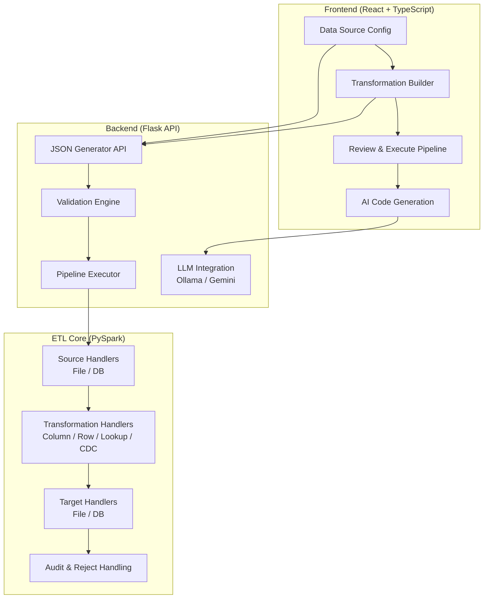
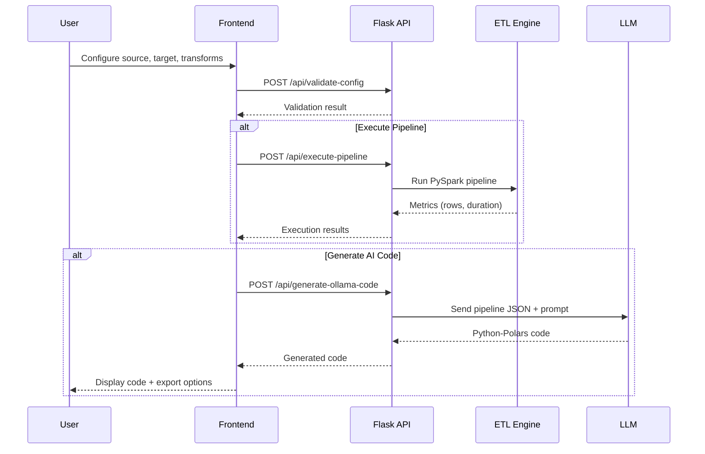

# Config-Driven PySpark ETL Engine — Problem Statement & PPT Content

---

## Slide 1 — Title Slide

**Config-Driven PySpark ETL Engine**
*"Give me a JSON, I'll run your pipeline."*

- Config-driven data pipeline framework with AI code generation
- Full-stack: React (Frontend) + Flask (Backend) + PySpark (ETL Core)
- AI-powered code generation via Ollama & Google Gemini

---

## Slide 2 — Problem Statement

### The Challenge

Enterprise data teams face recurring pain points when building ETL pipelines:

1. **Repetitive Code Development** — Engineers rewrite similar PySpark/Polars boilerplate for every new pipeline (read → transform → write), leading to duplicated effort and inconsistent quality.

2. **No Self-Service for Business Users** — Non-technical stakeholders cannot define or modify data pipelines without involving the engineering team, creating bottlenecks.

3. **Configuration Sprawl** — Pipeline logic is buried inside code. Changing a source, target, or transformation requires code changes, testing, and redeployment — even for trivial modifications.

4. **Multi-Database Complexity** — Organizations use Oracle, PostgreSQL, MySQL, and file-based sources (CSV, Parquet, TXT). Each requires different drivers, connection formats, and read/write patterns.

5. **Lack of Auditability** — Without a standard pipeline definition format, it is difficult to audit what transformations were applied, when, and by whom.

### The Goal

Build a **self-service, UI-driven platform** where users visually configure ETL pipelines through a web interface, and the system:
- Generates a **standardized JSON pipeline specification**
- Executes pipelines via the **PySpark ETL engine** using that JSON
- Optionally generates **standalone Python-Polars code** using AI (LLM)

---

## Slide 3 — Solution Architecture

---

## Slide 4 — Technology Stack

| Layer | Technology | Purpose |
|---|---|---|
| **Frontend** | React 18, TypeScript, Vite | Interactive pipeline design UI |
| **Styling** | Vanilla CSS | Responsive, custom-themed UI |
| **Backend API** | Python, Flask, Flask-CORS | REST API for config generation, validation, execution |
| **ETL Engine** | PySpark (Spark 3.x) | Core pipeline execution runtime |
| **AI Code Gen** | Ollama (CodeLlama 7B), Google Gemini | LLM-powered Python-Polars code generation |
| **Databases** | Oracle, PostgreSQL, MySQL, SQL Server | Multi-database read/write support |
| **File Formats** | CSV, TXT, DAT, Parquet, Excel | File-based source and target support |

---

## Slide 5 — Code Files & Functionality (Backend)

### Backend Core Files

| File | Lines | Functionality |
|---|---|---|
| [etl_engine.py](file:///Users/pavankumarvarakudujayaram/Desktop/Code/Config-PySpark-AI-App/backend/core/etl_engine.py) | 2,037 | **Core ETL Runtime** — Config parser ([ETLConfig](file:///Users/pavankumarvarakudujayaram/Desktop/Code/Config-PySpark-AI-App/backend/core/etl_engine.py#73-103)), Source handlers (File/DB read), Transformation handlers (Column transforms: upper/lower/trim/cast/literal/row_number/if_then_else/data_masking; Row transforms: filter/distinct/sort; Lookup/Join transforms; CDC compare), Target handlers (File/DB write), Audit & reject handling, Connection registry |
| [json_generator.py](file:///Users/pavankumarvarakudujayaram/Desktop/Code/Config-PySpark-AI-App/backend/json_generator.py) | 1,356 | **Flask API Server** — REST endpoints for: health check, config generation (`/api/generate-json`), config validation (`/api/validate-config`), config save/load/delete (`/api/save-config`, `/api/list-configs`, `/api/get-config`), pipeline execution (`/api/execute-pipeline`), AI code generation via Ollama (`/api/generate-ollama-code`) and Gemini (`/api/generate-gemini-code`), DB connection testing (`/api/test-connection`), file header extraction (`/api/file-headers`), file browsing (`/api/list-directory`) |
| [connection_setup.py](file:///Users/pavankumarvarakudujayaram/Desktop/Code/Config-PySpark-AI-App/backend/core/connection_setup.py) | 121 | **Database Connection Setup** — Registers Oracle, PostgreSQL, MySQL, SQL Server connections from [.env](file:///Users/pavankumarvarakudujayaram/Desktop/Code/Config-PySpark-AI-App/.env) credentials; registers lookup table DataFrames |

### Backend Scripts & Utilities

| File | Functionality |
|---|---|
| [run_pipeline.sh](file:///Users/pavankumarvarakudujayaram/Desktop/Code/Config-PySpark-AI-App/backend/scripts/run_pipeline.sh) | Shell script to execute a pipeline from a JSON config file via `spark-submit` |
| [setup.sh](file:///Users/pavankumarvarakudujayaram/Desktop/Code/Config-PySpark-AI-App/backend/scripts/setup.sh) | Environment setup — creates venv, installs Python dependencies |
| [setup_venv.sh](file:///Users/pavankumarvarakudujayaram/Desktop/Code/Config-PySpark-AI-App/backend/scripts/setup_venv.sh) | Virtual environment creation and activation script |
| [clean_multiline_csv.py](file:///Users/pavankumarvarakudujayaram/Desktop/Code/Config-PySpark-AI-App/backend/scripts/clean_multiline_csv.py) | Utility to clean multiline CSV files for processing |
| [example_usage.py](file:///Users/pavankumarvarakudujayaram/Desktop/Code/Config-PySpark-AI-App/backend/utils/example_usage.py) | Example demonstrating how to use the ETL engine programmatically |
| [test_connection.py](file:///Users/pavankumarvarakudujayaram/Desktop/Code/Config-PySpark-AI-App/backend/utils/test_connection.py) | Database connection test utility for Oracle, PostgreSQL, MySQL |
| [test_oracle_connection.py](file:///Users/pavankumarvarakudujayaram/Desktop/Code/Config-PySpark-AI-App/backend/test_oracle_connection.py) | Dedicated Oracle JDBC connection testing |

### Backend Config Files

| File | Functionality |
|---|---|
| [requirements.txt](file:///Users/pavankumarvarakudujayaram/Desktop/Code/Config-PySpark-AI-App/backend/requirements.txt) | Core Python dependencies (PySpark, python-dotenv) |
| [requirements_api.txt](file:///Users/pavankumarvarakudujayaram/Desktop/Code/Config-PySpark-AI-App/backend/requirements_api.txt) | API-specific dependencies (Flask, Flask-CORS, requests) |
| [.env](file:///Users/pavankumarvarakudujayaram/Desktop/Code/Config-PySpark-AI-App/.env) / [.env.example](file:///Users/pavankumarvarakudujayaram/Desktop/Code/Config-PySpark-AI-App/.env.example) | Database connection credentials (Oracle, PostgreSQL, MySQL, Gemini API key) |

---

## Slide 6 — Code Files & Functionality (Frontend)

### Frontend Components

| File | Lines | Functionality |
|---|---|---|
| [App.tsx](file:///Users/pavankumarvarakudujayaram/Desktop/Code/Config-PySpark-AI-App/frontend/src/App.tsx) | 143 | **Main Application Shell** — Step-based navigation (4 steps), global state management for config/spec, renders current step component |
| [DataSourceConfig.tsx](file:///Users/pavankumarvarakudujayaram/Desktop/Code/Config-PySpark-AI-App/frontend/src/components/DataSourceConfig.tsx) | 464 | **Step 1 — Data Source Configuration** — Mode selector (file-to-file, file-to-db, db-to-db, db-to-file), file path browser, database connection string input, schema/table config, DB connection testing, partition settings for parallel reads |
| [TransformationBuilder.tsx](file:///Users/pavankumarvarakudujayaram/Desktop/Code/Config-PySpark-AI-App/frontend/src/components/TransformationBuilder.tsx) | 1,655 | **Step 2 — Transformation Builder** — Field-level transforms (upper, lower, trim, cast, literal, row_number, current_date, if_then_else, data_masking/unmasking), Row-level transforms (filter, distinct, sort, CDC compare, lookup/join with surrogate key support), column reordering, auto-fetch source headers |
| [ExecutePipeline.tsx](file:///Users/pavankumarvarakudujayaram/Desktop/Code/Config-PySpark-AI-App/frontend/src/components/ExecutePipeline.tsx) | 689 | **Step 3 — Review & Execute** — JSON pipeline config generation from UI state, config save/load, saved config dropdown, pipeline execution with real-time status, execution metrics (source/target/reject row counts, CDC insert/update/delete counts, duration) |
| [CodeDisplay.tsx](file:///Users/pavankumarvarakudujayaram/Desktop/Code/Config-PySpark-AI-App/frontend/src/components/CodeDisplay.tsx) | 639 | **Step 4 — AI Code Generation** — LLM provider selection (Ollama/Gemini), saved JSON config dropdown, Upload JSON config, Generate Code button → calls LLM to produce Python-Polars code, progress bar, code display with analysis (imports, functions, DataFrame ops, optimizations) |
| [CodeExport.tsx](file:///Users/pavankumarvarakudujayaram/Desktop/Code/Config-PySpark-AI-App/frontend/src/components/CodeExport.tsx) | 260 | **Code Export Utilities** — Copy to clipboard, download as [.py](file:///Users/pavankumarvarakudujayaram/Desktop/Code/Config-PySpark-AI-App/verify_cdc.py) file, code statistics |
| [ErrorDisplay.tsx](file:///Users/pavankumarvarakudujayaram/Desktop/Code/Config-PySpark-AI-App/frontend/src/components/ErrorDisplay.tsx) | 143 | **Error Display Component** — Reusable error panel with error code, message, details, and retry button |
| [FileBrowserModal.tsx](file:///Users/pavankumarvarakudujayaram/Desktop/Code/Config-PySpark-AI-App/frontend/src/components/FileBrowserModal.tsx) | 163 | **File Browser Modal** — Server-side file/directory browsing via API, allows users to select source/target file paths |
| [JsonPreview.tsx](file:///Users/pavankumarvarakudujayaram/Desktop/Code/Config-PySpark-AI-App/frontend/src/components/JsonPreview.tsx) | 131 | **JSON Preview Component** — Formatted JSON display with syntax highlighting |

### Frontend Services & Types

| File | Lines | Functionality |
|---|---|---|
| [apiClient.ts](file:///Users/pavankumarvarakudujayaram/Desktop/Code/Config-PySpark-AI-App/frontend/src/services/apiClient.ts) | 314 | **API Client** — Axios-based HTTP client with retry logic, error handling, and typed methods for all backend endpoints (validate, generateJson, generateCode, generateAICode, getFileHeaders, testDbConnection, healthCheck, listDirectory) |
| [index.ts](file:///Users/pavankumarvarakudujayaram/Desktop/Code/Config-PySpark-AI-App/frontend/src/types/index.ts) | 145 | **TypeScript Type Definitions** — Interfaces for DataSourceConfig, FileSource/Target, DatabaseSource/Target, FieldTransformation, RowTransformation, Transform, TransformationConfig, ValidationResult, TransformationSpec, CodeGenerationTask/Status, LLMConfig |

### Frontend Styles

| File | Functionality |
|---|---|
| [styles.css](file:///Users/pavankumarvarakudujayaram/Desktop/Code/Config-PySpark-AI-App/frontend/src/components/styles.css) | Main application styles — layout, navigation, buttons, forms, code display |
| [DataSourceConfig.css](file:///Users/pavankumarvarakudujayaram/Desktop/Code/Config-PySpark-AI-App/frontend/src/components/DataSourceConfig.css) | Data source configuration panel styles |
| [ExecutePipeline.css](file:///Users/pavankumarvarakudujayaram/Desktop/Code/Config-PySpark-AI-App/frontend/src/components/ExecutePipeline.css) | Pipeline execution and status styles |
| [TransformationBuilder.css](file:///Users/pavankumarvarakudujayaram/Desktop/Code/Config-PySpark-AI-App/frontend/src/components/TransformationBuilder.css) | Transformation builder panel styles |
| [FileBrowserModal.css](file:///Users/pavankumarvarakudujayaram/Desktop/Code/Config-PySpark-AI-App/frontend/src/components/FileBrowserModal.css) | File browser modal dialog styles |

---

## Slide 7 — Code Files & Functionality (DevOps & Project)

| File | Functionality |
|---|---|
| [start_dev.sh](file:///Users/pavankumarvarakudujayaram/Desktop/Code/Config-PySpark-AI-App/start_dev.sh) | Starts both backend (Flask on port 9001) and frontend (Vite on port 3000/3007) dev servers |
| [stop_dev.sh](file:///Users/pavankumarvarakudujayaram/Desktop/Code/Config-PySpark-AI-App/stop_dev.sh) | Stops all running backend and frontend processes |
| [start_backend.sh](file:///Users/pavankumarvarakudujayaram/Desktop/Code/Config-PySpark-AI-App/start_backend.sh) | Starts only the backend Flask API server |
| `backend/config/*.json` | 19 saved pipeline JSON configuration files (examples and user-saved pipelines) |

---

## Slide 8 — Key Features

### 1. Visual Pipeline Designer (No-Code)
- 4-step wizard: Source → Transforms → Execute → AI Code
- Supports 4 pipeline modes: File→File, File→DB, DB→DB, DB→File

### 2. Rich Transformation Library
| Category | Transformations |
|---|---|
| **String** | upper, lower, trim, substring, concat, replace, pad |
| **Type** | cast, to_date, to_timestamp, to_number, format |
| **Logic** | if_then_else, case_when, coalesce, NVL |
| **Security** | data_masking (full/partial/base64), data_unmasking |
| **Row-level** | filter, distinct, sort, CDC compare |
| **Lookup** | join, surrogate key generation, aggregation |
| **Computed** | literal, row_number, current_date |

### 3. Multi-Database Connectivity
- Oracle, PostgreSQL, MySQL, SQL Server
- Connection testing from the UI
- Partitioned parallel reads for large tables

### 4. AI-Powered Code Generation
- **Ollama (Local)** — CodeLlama 7B model, runs entirely on-premises
- **Google Gemini (Cloud)** — Gemini Pro API for cloud-based generation
- Generates standalone **Python-Polars** code from pipeline JSON
- Load saved configs from dropdown and generate code in one click

### 5. Pipeline Execution & Monitoring
- Real-time execution status with progress logs
- Metrics: source/target/reject row counts, CDC insert/update/delete counts
- Save and reload pipeline configurations

---

## Slide 9 — Data Flow (End-to-End)

---

## Slide 10 — Future Enhancements

1. **Scheduling & Orchestration** — Integrate with Airflow/Prefect for scheduled pipeline runs
2. **Pipeline Versioning** — Track config changes with Git-like version history
3. **Data Preview** — Show sample data at each transformation step
4. **Monitoring Dashboard** — Historical execution metrics and alerting
5. **More LLM Models** — Support for OpenAI GPT, Anthropic Claude, local Mistral
6. **Cloud Deployment** — Dockerized deployment to AWS/GCP/Azure

---

## Slide 11 — Summary

| Metric | Value |
|---|---|
| **Total Backend Code** | ~3,500 lines (Python) |
| **Total Frontend Code** | ~4,700 lines (TypeScript/TSX) |
| **Total CSS** | ~35,000 bytes (5 files) |
| **Backend Endpoints** | 14 REST APIs |
| **Supported Databases** | 4 (Oracle, PostgreSQL, MySQL, SQL Server) |
| **Supported File Formats** | 5 (CSV, TXT, DAT, Parquet, Excel) |
| **Transformation Types** | 25+ (field, row, lookup, CDC) |
| **LLM Providers** | 2 (Ollama, Gemini) |

> **"Give me a JSON, I'll run your pipeline."**
